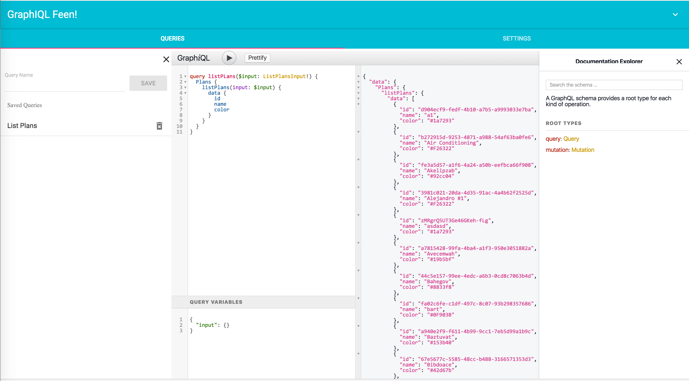

# GraphiQL Feen
========

Build: [](https://circleci.com/gh/bpatters/graphiql-feen)
[]()


This is a Chrome Extension that allows you to explore and test GraphQL endpoints. It utilizes the Popular GraphiQL component.

# Features

- Save Queries/Variables and load them on demand
- Add/Replace headers in HTTP requests
  - Required for appropriate CORS checking (specify the correct Origin: header for your request)
  - Override Cookies if necessary.
  - Only adds/replaces for the graphql Tabs requests.
- Import/Export your programs state so you can reload if necessary.
  - -Currently JSON format uses transit-immutables to serialize/deserialize the Immutable program state.-
  - 1.0.0 transitions us to Seamless Immutable, so you can export and easily edit your JSON state files and reimport

# Limitations
- Elevated permissions are required for header modifications -- Soon to be optional.

# Getting started

## Production build
```
npm run build
```

In chrome extensions use load unpacked extension and point it to the build directory.

## Development build

```
npm run dev
```
This build allows your extension to be loaded with the webpack hotloader.
In chrome extensions use load unpacked extension and point it to the dev directory.
CSS/Etc will automatically be loaded when changed for the graphiql page. If you change the background.* pages or the
plugin manifst you need to reload your plugin manually in chrome extensions.
